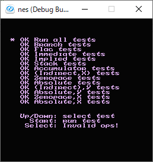
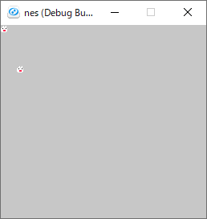
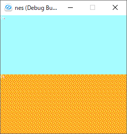
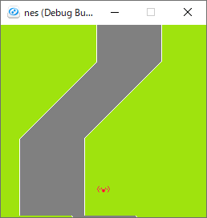

# これはなに
NES エミュレータを作ってみたかった

# ビルド方法
```
$ mkdir ./Outputs
$ cd Outputs 
$ cmake ..
$ cmake --build .
```
# 動かしてみる
EmotionalEngine-NES は NES エミュレータのロジック部分のみを提供するライブラリです。実際に nes を動作させて nes のソフトをプレイするにはライブラリをリンクしたフロントエンドの実装が必要になります。動作確認用のテストとして `testPpu_PpuGraphicwithUI` を添付してありますので、それを使って動かす手順をここに記述します。
## 動作環境  
Windows10 + Visual Studio 2019 で動作確認しています。  
`testPpu_PpuGraphicwithUI` は Siv3D 0.4.3 に依存しますので、あらかじめインストールしておく必要があります。
## ライブラリをビルドする
上記の ビルド方法 の通りにビルドします。ただし、 `CMakeLists.txt` のコメントアウトされている箇所 `#set(CMAKE_CXX_FLAGS_DEBUG "/MTd")` のコメントアウトを外しておきます。  
- `testPpu_PpuGraphicwithUI` のプロジェクトファイルが上記ビルド成果物に依存しているので、ビルドディレクトリの名前は `Outputs` にしてください。

## テストを実行する
- `Tests/Integrate/Graphic/testPpu_PpuGraphicwithUI/testPpu_PpuGraphicwithUI.sln` を Visual Studio 2019 で開きます。  
- `Tests/TestBinaries/` 以下に rom ファイルを置き、 `Tests/Integrate/Graphic/testPpu_PpuGraphicwithUI/Main.cpp` を参考にパスをハードコードします。(雑ですが、あくまでテストプログラムであるのでサボっています。)  
- Visual Studio からテストをビルドして実行すると、前手順で指定した rom が実行されます。  
# スクリーンショットたち  
- Hello World & nestest



- mario


- donkey


# ｷﾞｺ猫


# ディレクトリ構成
```
.
├── Include
├── Programs
│   └── src
├── Tests
│   └── TestBinaries
└── readme.md
```
## ./Include
EmotionalNES ライブラリの公開ヘッダーを格納します。
## Programs/src
EmotionalNES ライブラリのソースコードを格納します。とりあえずフラットに全部置きます。やばくなってきたら整理する……
# Tests
{単体, 統合}テストを格納します。適宜ディレクトリを切ることにします。
# Tests/TestBinaries
テスト用のバイナリを配置します。主に配布されている nes のテスト用 ROM を配置して、テストから参照します。

# 開発
PR 前に以下の手順でテストを実行して通ることを確認します。  
(ビルド方法 の手順が済んでいる前提)  
```
$ cd Outputs 
$ cmake --build .
$ ctest -C Debug
```